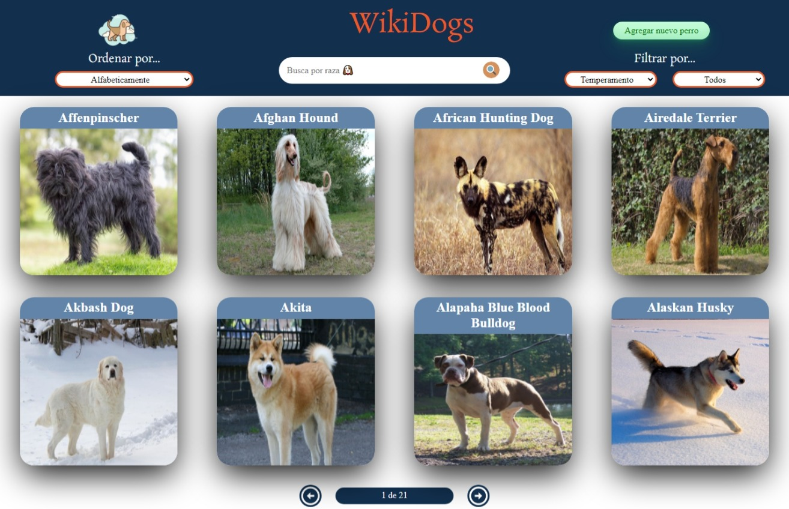

<h1 align="center">Hola 👋, Yo soy Wenceslao Rojas</h1>
<h3 align="center">Un apasionado desarrollador de Argentina! 🧉</h3>

- 🔭 Estuve trabajando en el proyecto [WikiDogs](https://wikidog-wenceslaorojas.netlify.app/)

- 🌱 Actualmente estoy aprendiendo **Machine Learning con Python**

- 👯 Y colabore en el proyecto [Aplicacion del clima](https://clima-app-rh-wr.netlify.app/)

- También desarrollé la aplicación [Tip Calculator](https://61770c0140ba11fd14ff9185--wenceslaorojas-tipapp.netlify.app/)

- 💬 Puedes consultarme sobre **HTML5, CSS3, Sass, React, Redux, Node, Express, PostgreSQL y Sequealize**

- 📫 Si quieres puedes escribirme en **wenceslao.roja@gmail.com**

<h2> Proyecto WikiDogs </h2>
La aplicacion te permite ver distintas razas de perro junto con información relevante de las mismas utilizando la api externa "the dog api" y a partir de ella poder, entre otras cosas:

- Buscar perros

- Filtrarlos / Ordenarlos

- Agregar nuevos perros

Para la realización utilicé React con Redux para el front y para el desarrollo del Backend utilicé NodeJs con Express, en la base de datos implemente PostgreSQL con Sequelize.

<h3 align="left">Connect with me:</h3>

<h3 align="left">Languages and Tools:</h3>

                

